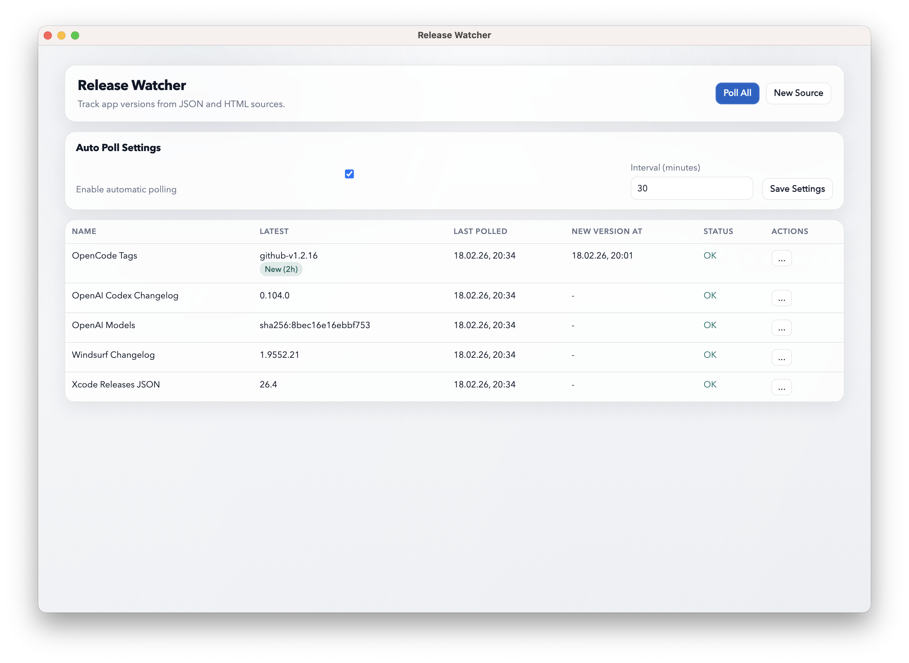

# Release Watcher

Release Watcher is a desktop app that tracks version changes across web sources and notifies you of new releases.

It supports JSON APIs and HTML changelog pages, remembers what was seen last time, and shows notifications when something new appears.

## Screenshots

| Screenshot 1 | Screenshot 2 |
| --- | --- |
|  |  |

## What it does

- Add, edit, and delete watched sources from the UI.
- Poll JSON or HTML endpoints.
- Use selectors to pick the value you care about:
  - JSON examples: `0.name`, `.data[].id`, `releases[0].version`
  - HTML: CSS selector + optional attribute
- Optionally apply regex extraction after selector output.
- Send custom request headers per source (useful for authenticated APIs)
- Send native system notifications on detected changes.

## Run locally

```bash
npm install
npm run dev
```

Production-style local run:

```bash
npm start
```

## Development commands

```bash
# Type-check both main and renderer
npm run typecheck

# Lint with strict TypeScript rules
npm run lint

# Lint and auto-fix
npm run lint:fix

# Format project files
npm run format
```

Watch mode (rebuild + restart Electron on file changes):

```bash
npm run dev:watch
```

## Build for macOS

```bash
npm install
npm run dist:mac
```

Artifacts are generated in `release/` (DMG + ZIP).

To install:

1. Open the generated `.dmg`.
2. Drag `Release Watcher.app` to `/Applications`.
3. Launch from Applications.

## Data location

The app uses a shared config location so dev and production builds read the same data.

- macOS: `~/Library/Application Support/pl.alorenc.releasewatcher/config.yaml`
- other platforms: `<appData>/pl.alorenc.releasewatcher/config.yaml`

Stored data includes:

- source definitions
- latest values and fingerprints
- timestamps (`lastPolledAt`, `lastChangeAt`, `newVersionAt`)
- poll status/errors
- auto-poll settings
- unseen update badge state

Implementation note:

- The file is written as YAML-compatible JSON content for portability.

Migration note:

- On first run, a legacy `release-watcher-data.json` from Electron `userData` is imported into `config.yaml` if present.

## Behavior notes

- The first successful poll sets a baseline and does not trigger a "new version" notification.
- Regex can be provided either as a plain pattern or `/pattern/flags`.

## Project structure

- `src/main/` Electron main process (window/tray/polling/IPC/storage)
- `src/preload/` context bridge API
- `src/renderer/` UI (TypeScript + HTML/CSS)
- `src/shared/` shared types
- `dist/` compiled output
